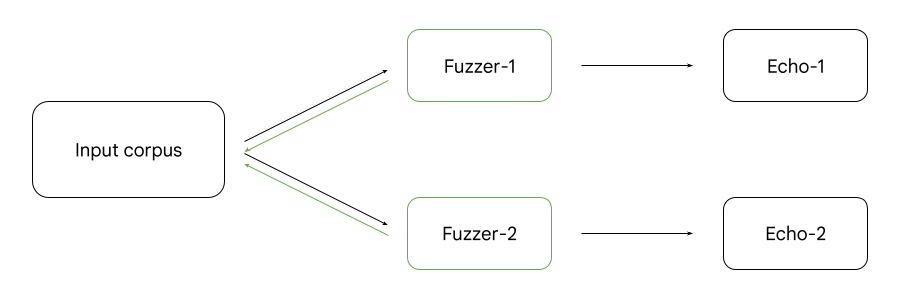

# Gudifu
Gudifu (**Gu**ided **Di**fferential **Fu**zzer) is a coverage-guided fuzzing tool.

## How it works
The diagram above shows the main components of Gudifu. Fuzzers are essentially
binaries which contain both the libfuzzer and libfuzzer-instrumented HTTP proxy.
Input corpus is a directory where each file contains an input
(i.e., an HTTP request). Echo servers are TCP listeners for
capturing requests forwarded by targets.

In each iteration, each libfuzzer instance (e.g., Fuzzer-1) takes an input from the
input corpus, applies mutations on the input and delivers it to its respective
instrumented HTTP proxy. If the input is an interesting one (meaning it
achieves new code coverage), it is added back to the corpus for additional
fuzzing (represented in green arrows). Thanks to the corpus reloading which is
done by each fuzzer instance every second (by default), interesting inputs are
shared among targets.

Once a fuzzer delivers a request to the HTTP proxy, the HTTP proxy forwards
the request to the echo server.
Echo server captures the forwarded request and saves it to the filesystem.
To keep track of what forwarded request matches what input request, the fuzzer
adds the hash of the request to itself (e.g., as a header) before the delivery.

## Getting Started

If you run the commands shown below for each target (see `/targets`),
you will get guided differential fuzzing started. `<target-name>` in the commands
below is a placeholder for the target name.

1. `git clone https://github.com/bahruzjabiyev/Gudifu and cd Gudifu`

2. `docker build -t gudifu/<target-name> -f targets/<target-name>.`

3. `docker run -ti -v <your-local-dir>/logs:/logs -v <your-local-dir>/corpus:/corpus gudifu/<target-name> bash`

- The `corpus` directory in your local filesystem will be shared by all fuzzers and will serve as an input corpus for all of them.
The `logs` in your local will be used to save the inputs fuzzers generate and also the requests proxies forward.

4. `python3 common/echo_server.py <target-name>` (should be run in the container)

5. `/out/<fuzzer-binary> /corpus` (should be run in the container)

## Miscellaneous
We have some extra suggestions here.

### Generating HTTP/1 Corpus

You can use the command below to create an HTTP/1 corpus.

`python3 common/generate_corpus.py <your-local-dir>/corpus/`

### Categorization of Behavior Differences

Let's say you used the commands given above to run your experiments. Now, you
have all input requests and forwarded requests saved in a `<your-local-dir>/logs`.

1. `python common/compare.py <your-local-dir>/logs/ > /tmp/ouput`

- This command writes all the deletions, additions and modifications done by
  each proxy on each input request to the `/tmp/output`. Each line has the
  following format: `additions ::::: da856772d5f25693bf6dd541964cafc43ca0e722 ::::: envoy
  ::::: b'x-forwarded-proto: http'`. For example, this line means that Envoy
  Proxy added `x-forwarded-proto: http` to the input request which has the
  SHA-1 hash shown above. To see the full versions of input and forwarded
  requests, check out the `<your-local-dir>/logs/input_<hash>` and
  `<your-local-dir>/logs/envoy_<hash>` respectively.

2. `awk -f common/stats.awk op=deletions diff=true /tmp/output`

- This command shows deletion actions done by each proxy. `op=deletions` can be changed
to `op=modifications` and `op=additions`. `diff=true` makes it show only those actions which
are by one proxy but not the other.
